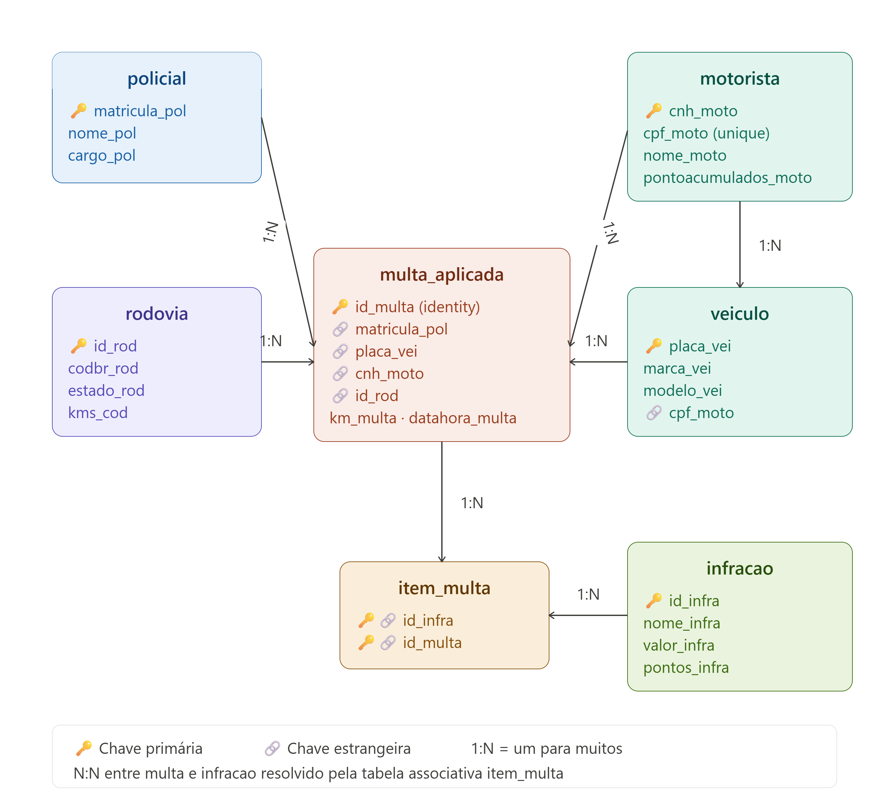

# SigMul — Sistema de Gestão de Multas

## 1. Descrição do Sistema

**Nome:** SigMul — Sistema de Gestão de Multas  
**Área de atuação:** Fiscalização e controle de trânsito rodoviário  
**Objetivo:** Centralizar o registro, consulta e gestão de autuações de trânsito, integrando dados de motoristas, veículos, policiais, rodovias e infrações em um único sistema.  
**Problema que resolve:** A ausência de um sistema unificado causa fragmentação de dados e lentidão nos processos de fiscalização. O SigMul elimina esse problema ao concentrar todas as operações em um banco relacional com acesso via Java/JDBC, garantindo integridade referencial e rastreabilidade das multas aplicadas.

---

## 2. Banco de Dados

### 2.1 Modelo de Dados



O banco é composto por **7 entidades**, todas com relacionamentos definidos por chaves primárias e estrangeiras:

| Entidade | Descrição |
|---|---|
| `motorista` | Condutor habilitado, identificado pela CNH |
| `policial` | Agente responsável pela autuação |
| `veiculo` | Veículo autuado, vinculado ao motorista proprietário |
| `rodovia` | Trecho rodoviário onde a infração ocorreu |
| `infracao` | Tipo de infração com valor e pontuação |
| `multa_aplicada` | Registro da autuação em si |
| `item_multa` | Relacionamento N:N entre multa e infração |

**Relacionamentos:**
- Um motorista pode ter vários veículos e várias multas
- Uma multa é aplicada por um policial, em um veículo, em uma rodovia
- Uma multa pode conter várias infrações (via `item_multa`)
- Um veículo pertence a um motorista (via CPF)

### 2.2 Script DDL

```sql
CREATE TABLE public.policial (
    matricula_pol int4 NOT NULL,
    nome_pol varchar(100) NOT NULL,
    cargo_pol varchar(50) NOT NULL,
    CONSTRAINT policial_pkey PRIMARY KEY (matricula_pol)
);

CREATE TABLE infracao (
    id_infra int4 NOT NULL,
    nome_infra varchar(200) NOT NULL,
    descricacao_infra text NOT NULL,
    valor_infra numeric(10, 2) NOT NULL,
    pontos_infra int4 NOT NULL,
    CONSTRAINT infracao_pkey PRIMARY KEY (id_infra)
);

CREATE TABLE motorista (
    cnh_moto varchar(11) NOT NULL,
    cpf_moto varchar(11) NOT NULL,
    nome_moto varchar(100) NOT NULL,
    pontoacumulados_moto int4 NOT NULL,
    CONSTRAINT motorista_cpf_moto_key UNIQUE (cpf_moto),
    CONSTRAINT motorista_pkey PRIMARY KEY (cnh_moto)
);

CREATE TABLE public.veiculo (
    placa_vei varchar(7) NOT NULL,
    marca_vei varchar(50) NOT NULL,
    modelo_vei varchar(50) NOT NULL,
    anofabricacao_vei int4 NOT NULL,
    cpf_moto varchar(11) NULL,
    CONSTRAINT veiculo_pkey PRIMARY KEY (placa_vei)
);

CREATE TABLE public.rodovia (
    id_rod int4 NOT NULL,
    codbr_rod varchar(10) NOT NULL,
    estado_rod varchar(50) NOT NULL,
    kms_cod int4 NOT NULL,
    CONSTRAINT rodovia_pkey PRIMARY KEY (id_rod)
);

CREATE TABLE public.multa_aplicada (
    id_multa int4 GENERATED ALWAYS AS IDENTITY NOT NULL,
    matricula_pol int4 NOT NULL,
    placa_vei varchar(7) NOT NULL,
    cnh_moto varchar(11) NULL,
    id_rod int4 NOT NULL,
    km_multa int4 NOT NULL,
    datahora_multa timestamptz DEFAULT CURRENT_TIMESTAMP NULL,
    CONSTRAINT multa_aplicada_pkey PRIMARY KEY (id_multa),
    CONSTRAINT fk_motorista FOREIGN KEY (cnh_moto) REFERENCES motorista(cnh_moto),
    CONSTRAINT fk_policial FOREIGN KEY (matricula_pol) REFERENCES policial(matricula_pol),
    CONSTRAINT fk_rodovia FOREIGN KEY (id_rod) REFERENCES rodovia(id_rod),
    CONSTRAINT fk_veiculo FOREIGN KEY (placa_vei) REFERENCES veiculo(placa_vei)
);

CREATE TABLE item_multa (
    id_infra int4 NOT NULL,
    id_multa int4 NOT NULL,
    CONSTRAINT item_multa_pkey PRIMARY KEY (id_infra, id_multa),
    CONSTRAINT fk_rel_infracao FOREIGN KEY (id_infra) REFERENCES infracao(id_infra),
    CONSTRAINT fk_rel_multa FOREIGN KEY (id_multa) REFERENCES multa_aplicada(id_multa)
);

ALTER TABLE veiculo ADD CONSTRAINT fk_veiculo_proprietario
    FOREIGN KEY (cpf_moto) REFERENCES motorista(cpf_moto);
```

**View — `vw_multas_aplicadas`:**

```sql
CREATE OR REPLACE VIEW public.vw_multas_aplicadas AS
SELECT
    ma.id_multa,
    ma.datahora_multa AS data_hora,
    mot.nome_moto     AS motorista,
    mot.cpf_moto,
    vei.placa_vei     AS placa,
    vei.modelo_vei    AS veiculo,
    inf.nome_infra    AS infracao,
    inf.valor_infra   AS valor,
    r.codbr_rod       AS rodovia,
    pol.nome_pol      AS policial
FROM item_multa im
         JOIN infracao       inf ON inf.id_infra      = im.id_infra
         JOIN multa_aplicada ma  ON ma.id_multa       = im.id_multa
         JOIN motorista      mot ON mot.cnh_moto      = ma.cnh_moto
         JOIN veiculo        vei ON vei.placa_vei     = ma.placa_vei
         JOIN rodovia        r   ON r.id_rod          = ma.id_rod
         JOIN policial       pol ON pol.matricula_pol = ma.matricula_pol;
```

**Procedure — `atualizar_pontos_motorista`:**

Recebe a CNH do motorista e um número de pontos, e atualiza diretamente o campo `pontoacumulados_moto` no banco.

```sql
CREATE OR REPLACE PROCEDURE public.atualizar_pontos_motorista(p_cnh VARCHAR, p_pontos INT)
LANGUAGE plpgsql AS $$
BEGIN
    UPDATE motorista
    SET pontoacumulados_moto = pontoacumulados_moto + p_pontos
    WHERE cnh_moto = p_cnh;
END;
$$;
```

**Function — `resumo_motorista`:**

Recebe a CNH de um motorista e retorna uma tabela com nome, total de multas, valor total acumulado, pontos totais e a infração mais frequente — reunindo em um único cálculo um resumo completo do histórico do condutor.

```sql
CREATE OR REPLACE FUNCTION public.resumo_motorista(p_cnh character varying)
RETURNS TABLE(
    nome character varying,
    total_multas bigint,
    valor_total numeric,
    pontos_totais integer,
    infracao_mais_comum character varying
)
LANGUAGE plpgsql AS $$
BEGIN
    RETURN QUERY
    SELECT
        mo.nome_moto,
        COUNT(DISTINCT ma.id_multa),
        SUM(inf.valor_infra),
        mo.pontoacumulados_moto,
        (
            SELECT inf2.nome_infra
            FROM item_multa im2
                JOIN multa_aplicada ma2 ON ma2.id_multa = im2.id_multa
                JOIN infracao inf2       ON inf2.id_infra = im2.id_infra
            WHERE ma2.cnh_moto = p_cnh
            GROUP BY inf2.nome_infra
            ORDER BY COUNT(*) DESC
            LIMIT 1
        )
    FROM motorista mo
        JOIN multa_aplicada ma ON ma.cnh_moto = mo.cnh_moto
        JOIN item_multa im     ON im.id_multa  = ma.id_multa
        JOIN infracao inf      ON inf.id_infra = im.id_infra
    WHERE mo.cnh_moto = p_cnh
    GROUP BY mo.nome_moto, mo.pontoacumulados_moto;
END;
$$;
```

### 2.3 Script DML

**Inserções de exemplo:**

```sql
INSERT INTO policial (matricula_pol, nome_pol, cargo_pol)
VALUES (1001, 'Carlos Souza', 'Agente de Trânsito');

INSERT INTO motorista (cnh_moto, cpf_moto, nome_moto, pontoacumulados_moto)
VALUES ('12345678999', '99987654321', 'Mailson Suzarte', 3);

INSERT INTO veiculo (placa_vei, marca_vei, modelo_vei, anofabricacao_vei, cpf_moto)
VALUES ('ABC1234', 'Honda', 'Civic', 2021, '99987654321');

INSERT INTO infracao (id_infra, nome_infra, descricacao_infra, valor_infra, pontos_infra)
VALUES (1, 'Excesso de velocidade', 'Acima de 20% do limite permitido', 195.23, 5);

INSERT INTO multa_aplicada (matricula_pol, placa_vei, cnh_moto, id_rod, km_multa)
VALUES (1001, 'ABC1234', '12345678999', 1, 142);

INSERT INTO item_multa (id_infra, id_multa) VALUES (1, 1);
```

**Atualização:**

```sql
UPDATE motorista
SET pontoacumulados_moto = pontoacumulados_moto + 5
WHERE cnh_moto = '12345678999';
```

**Exclusão:**

```sql
DELETE FROM item_multa WHERE id_multa = 2;
DELETE FROM multa_aplicada WHERE id_multa = 2;
```

**Consultas com JOIN:**

```sql
-- JOIN 1: multas com nome do motorista e policial responsável
SELECT ma.id_multa, mot.nome_moto, pol.nome_pol, ma.datahora_multa
FROM multa_aplicada ma
JOIN motorista mot ON ma.cnh_moto = mot.cnh_moto
JOIN policial  pol ON ma.matricula_pol = pol.matricula_pol;

-- JOIN 2: infrações detalhadas por multa com valor
SELECT ma.id_multa, mot.nome_moto, inf.nome_infra, inf.valor_infra
FROM multa_aplicada ma
JOIN item_multa im  ON ma.id_multa  = im.id_multa
JOIN infracao  inf  ON im.id_infra  = inf.id_infra
JOIN motorista mot  ON ma.cnh_moto  = mot.cnh_moto;

-- JOIN 3: veículo, proprietário e rodovia onde foi autuado
SELECT vei.placa_vei, vei.modelo_vei, mot.nome_moto, r.codbr_rod, ma.km_multa
FROM multa_aplicada ma
JOIN veiculo   vei ON ma.placa_vei = vei.placa_vei
JOIN motorista mot ON ma.cnh_moto  = mot.cnh_moto
JOIN rodovia   r   ON ma.id_rod    = r.id_rod;
```

---

## 3. Sistema em Java (JDBC)

### 3.1 Conexão com o Banco

A conexão é gerenciada pela classe `ConexaoBanco`, que utiliza a biblioteca **Dotenv** para ler as credenciais de um arquivo `.env` local (nunca exposto no repositório):

```
DB_URL=jdbc:postgresql://localhost:5432/v1_sigmul
DB_USER=postgres
DB_PASSWORD=sua_senha
```

Isso garante que usuário e senha nunca sejam commitados no Git.

### 3.2 Arquitetura do Projeto

O projeto segue o padrão **DAO (Data Access Object)**, separando responsabilidades em camadas:

```
com.sigmul/
├── Main.java                     → ponto de entrada, menu principal
├── model/                        → representação das entidades em Java
│   ├── Motorista, Policial, Veiculo, Rodovia
│   ├── Infracao, MultaAplicada, ItemMulta
│   └── VwMultaAplicada           → model da view
├── DAO/                          → acesso ao banco por entidade
│   ├── MotoristaDAO, PolicialDAO, VeiculoDAO
│   ├── RodoviaDAO, InfracaoDAO
│   ├── MultaAplicadaDAO          → inclui chamada à Function e Procedure
│   ├── ItemMultaDAO
│   └── VwMultaAplicadaDAO        → consulta à view
├── menu/                         → menus interativos por entidade
│   ├── MenuMulta, MenuMotorista, MenuPolicial
├── LeitorEntrada/
│   └── LeitorEntrada.java        → leitura segura de input do usuário
└── gestao_banco/
    └── ConexaoBanco.java         → gerencia a conexão JDBC
```

### 3.3 CRUD Completo

Todas as operações são feitas via `PreparedStatement`, usando `?` como placeholder para evitar SQL Injection.

| Operação | Método SQL | Método Java |
|---|---|---|
| Inserir | `INSERT` | `executeUpdate()` |
| Consultar | `SELECT` | `executeQuery()` + `ResultSet` |
| Atualizar | `UPDATE` | `executeUpdate()` |
| Deletar | `DELETE` | `executeUpdate()` |

Transações com `conn.setAutoCommit(false)` + `conn.commit()` garantem que operações compostas (multa + item_multa) sejam gravadas juntas ou revertidas em caso de erro.

### 3.4 Uso da View

A view `vw_multas_aplicadas` é consultada pelo `VwMultaAplicadaDAO` como se fosse uma tabela comum:

```java
String sql = "SELECT * FROM vw_multas_aplicadas";
PreparedStatement stmt = conn.prepareStatement(sql);
ResultSet rs = stmt.executeQuery();
```

---

## 4. Recursos Avançados

### 4.1 Function — `resumo_motorista`

Recebe a CNH do motorista e retorna uma tabela com nome, total de multas, valor acumulado, pontos totais e a infração mais frequente. Reúne em um único cálculo SQL todo o histórico do condutor. É chamada no Java via `SELECT` comum:

```java
String sql = "SELECT * FROM resumo_motorista(?)";
PreparedStatement stmt = conn.prepareStatement(sql);
stmt.setString(1, cnh);
ResultSet rs = stmt.executeQuery();
// rs contém: nome, total_multas, valor_total, pontos_totais, infracao_mais_comum
```

Usada no menu **"Gerenciar Motoristas → Ver resumo do motorista"**.

### 4.2 Procedure — `atualizar_pontos_motorista`

Atualiza os pontos acumulados do motorista diretamente no banco. É chamada no Java via `CallableStatement`:

```java
CallableStatement cs = conn.prepareCall("{call atualizar_pontos_motorista(?, ?)}");
cs.setString(1, cnh);
cs.setInt(2, pontos);
cs.execute();
```

Usada no menu **"Gerenciar Motoristas → Atualizar pontos (via Procedure)"**.

### 4.3 Regras de Negócio

1. **Acúmulo de pontos:** ao registrar uma multa, os pontos da infração são somados automaticamente ao total do motorista.
2. **Multa com múltiplas infrações:** uma única autuação pode conter várias infrações simultâneas, registradas em `item_multa`.
3. **Integridade referencial:** não é possível registrar uma multa sem que o policial, veículo, motorista e rodovia existam previamente no banco.

---

## 5. Conclusão

### Aprendizados
- Aplicação prática do padrão DAO para separação entre lógica de negócio e acesso a dados
- Uso de transações JDBC para garantir consistência em operações compostas
- Criação e uso de Views, Procedures e Functions em PostgreSQL integradas ao Java
- Gerenciamento seguro de credenciais com variáveis de ambiente via Dotenv

### Dificuldades encontradas
- Curva de aprendizado no uso do JDBC, principalmente no controle manual de conexões, `PreparedStatement` e transações (`commit`/`rollback`) em operações compostas
- Conflitos de versão do projeto no Git durante o desenvolvimento em dupla, com divergências de dependências e configuração que quebraram arquivos e exigiram resolução manual
- Dificuldade na criação e no uso correto de Functions e Procedures no PostgreSQL, especialmente na definição de parâmetros, tipos de retorno e na chamada via `CallableStatement`/`PreparedStatement` a partir do Java
- Exclusão de registros sem qualquer histórico ou log: ao remover uma multa ou item relacionado, a informação se perde por completo do banco, o que é problemático tratando-se de dados de fiscalização que precisam ser auditáveis

### Possíveis melhorias
- Interface gráfica com JavaFX ou frontend web conectado via API REST
- Relatórios em PDF com histórico de multas por motorista
- Identificação do veículo pela placa em vez do ID interno do banco, tornando a busca mais natural para o usuário
- Permitir o registro de mais de uma infração na mesma multa diretamente pelo fluxo do menu, aproveitando a estrutura já existente de `item_multa`
- Implementação de log de auditoria para exclusões, garantindo rastreabilidade de multas removidas

---

## Stack Tecnológica

| Camada | Tecnologia |
|---|---|
| Backend | Java 17+ |
| Banco de Dados | PostgreSQL 15+ |
| Persistência | JDBC |
| Build | Maven |
| Testes | JUnit 5 |
| Segurança | Dotenv (variáveis de ambiente) |